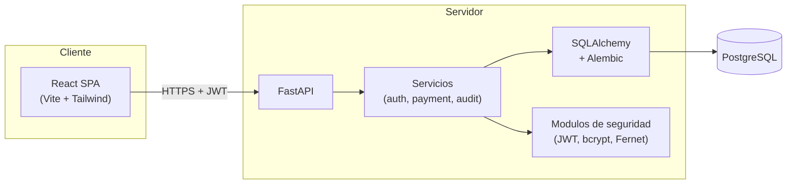

# Arquitectura

La aplicacion sigue una arquitectura por capas, cercana a MVC, donde la
responsabilidad de cada modulo esta claramente delimitada. El frontend es
una SPA que consume la API HTTP del backend.

## Vista general



Diagrama equivalente en ASCII por si el visor no soporta Mermaid:

```
+-------------------+         +-------------------------+
|     React SPA     |  HTTP   |        FastAPI          |
| (Vite + Tailwind) +-------->+   Controllers           |
+-------------------+         +-----+-------------------+
                                    |
                                    v
                              +-----+-------------------+
                              |   Servicios de negocio  |
                              |  (auth, payment, audit) |
                              +-----+-------+-----------+
                                    |       |
                          (cifrado) |       | (acceso a datos)
                                    v       v
                              +-----+--+ +--+------------+
                              | Crypto | | SQLAlchemy /  |
                              | JWT    | | Alembic       |
                              +--------+ +-+-------------+
                                            |
                                            v
                                       +----+-----+
                                       | Postgres |
                                       +----------+
```

## Capas del backend

| Capa            | Carpeta            | Responsabilidad |
|-----------------|--------------------|-----------------|
| Controllers     | `app/controllers/` | Definir endpoints REST, validar entrada con Pydantic y mapear errores de negocio a respuestas HTTP. |
| Schemas         | `app/schemas/`     | Modelos Pydantic para validacion de entrada y serializacion de salida. Aqui se aplica la separacion entre datos publicos y sensibles. |
| Servicios       | `app/services/`    | Logica de negocio. No tocan FastAPI ni HTTP; reciben una sesion de BD y datos validados. |
| Modelos         | `app/models/`      | Modelos SQLAlchemy 2 declarativos con tipos, indices y restricciones. |
| Core            | `app/core/`        | Configuracion (Pydantic Settings), conexion a BD, dependencias compartidas, hashing de contrasenas, emision de JWT y cifrado Fernet. |
| Alembic         | `alembic/`         | Migraciones versionadas del esquema relacional. |

La regla es que las capas superiores solo dependen de las inferiores, nunca al
reves. Por ejemplo, los servicios pueden importar modelos y crypto, pero los
modelos no conocen los servicios.

## Frontend

| Carpeta              | Responsabilidad |
|----------------------|-----------------|
| `src/pages/`         | Vistas asociadas a rutas (Login, Register, Profile, listados, detalle, alta). |
| `src/components/`    | Piezas reutilizables como Navbar, PaymentMethodCard, Alert y ProtectedRoute. |
| `src/context/`       | `AuthContext` con persistencia del usuario y el token en localStorage. |
| `src/services/api.js`| Cliente axios con interceptores que inyectan el JWT y manejan el 401. |

El router (React Router) decide si una ruta es publica (`/login`, `/register`)
o protegida (todo lo demas) y, en este ultimo caso, redirige al login si no
existe token.

## Flujo de una operacion tipica

1. El cliente envia `POST /payment-methods` con los datos del nuevo metodo.
2. FastAPI valida el cuerpo contra `PaymentMethodCreate`.
3. La dependencia `get_current_user` resuelve el JWT y carga al usuario.
4. El controlador delega en `payment_method_service.create_method`, que:
   - Aplica reglas minimas de negocio (longitud y caracteres permitidos del identificador).
   - Calcula el fingerprint HMAC del identificador y revisa duplicados.
   - Cifra el identificador con Fernet y guarda el last4 visible.
   - Inserta el renglon y deja una entrada en `audit_logs`.
5. El controlador devuelve la representacion enmascarada (`PaymentMethodRead`).

## Decisiones tomadas en la arquitectura

- **Servicios delgados, controladores delgados, modelos sin logica**:
  facilita las pruebas y permite reusar la logica de negocio fuera de HTTP
  (por ejemplo, en jobs o tests directos sobre la BD).
- **Errores de negocio como excepciones**: cada servicio define una excepcion
  propia (`AuthError`, `PaymentMethodError`) con `status_code`. El controlador
  la captura y la traduce a `HTTPException`. Asi los servicios pueden testarse
  sin instanciar FastAPI.
- **Auditoria centralizada**: un unico servicio (`audit_service.record_event`)
  inserta filas en `audit_logs`. Las acciones que se registran estan tipadas
  con un enum (`AuditAction`) para evitar strings sueltas.
- **Persistencia local del token**: la SPA guarda el JWT en localStorage para
  que el refresh no rompa la sesion. Para una entrega productiva convendria
  cambiarlo por una cookie HttpOnly + SameSite emitida por el backend.

## Diagramas adicionales

- Modelo de datos: ver [DATABASE.md](DATABASE.md).
- Esquema de seguridad y trazabilidad: ver [SECURITY.md](SECURITY.md).
