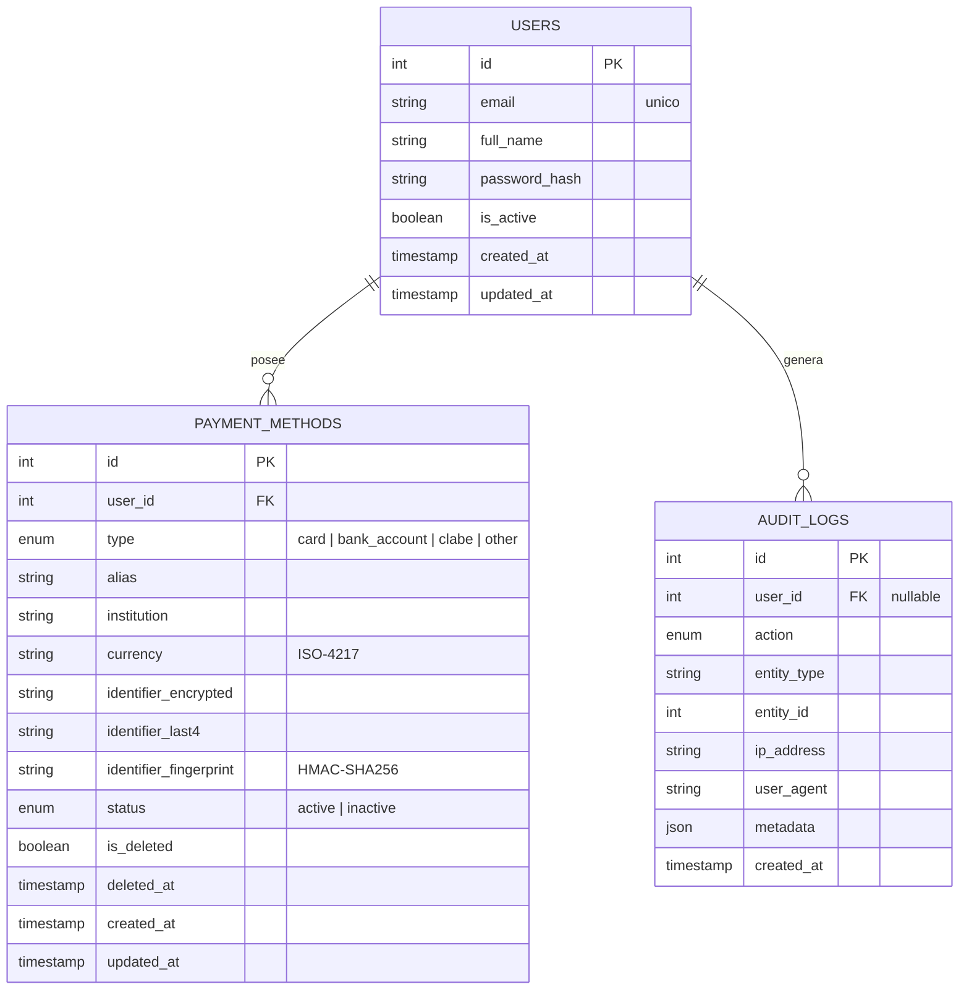

# Base de datos

El esquema es relacional y consta de tres tablas: `users`, `payment_methods` y
`audit_logs`. Se utiliza PostgreSQL 16 por su soporte a tipos enumerados,
restricciones complejas y JSON nativo, util para la columna `metadata` de la
bitacora.

## Diagrama entidad-relacion



Equivalente en ASCII:

```
+----------------+        +-------------------------+
|    users       | 1    * |    payment_methods      |
+----------------+--------+-------------------------+
| id (PK)        |        | id (PK)                 |
| email (uq)     |        | user_id (FK)            |
| full_name      |        | type (enum)             |
| password_hash  |        | alias                   |
| is_active      |        | institution             |
| created_at     |        | currency                |
| updated_at     |        | identifier_encrypted    |
+--------+-------+        | identifier_last4        |
         |                | identifier_fingerprint  |
         |                | status (enum)           |
         |                | is_deleted / deleted_at |
         |                | created_at / updated_at |
         |                +-------------------------+
         |
         | 1   *
         v
   +-----+----------------+
   |   audit_logs         |
   +----------------------+
   | id (PK)              |
   | user_id (FK)         |
   | action (enum)        |
   | entity_type / id     |
   | ip_address           |
   | user_agent           |
   | metadata (json)      |
   | created_at           |
   +----------------------+
```

## Tabla `users`

| Columna         | Tipo         | Restricciones | Notas |
|-----------------|--------------|---------------|-------|
| id              | integer      | PK            | autoincremental |
| email           | varchar(254) | not null, unique | indice unico para consultas por correo |
| full_name       | varchar(120) | not null      | nombre mostrado en la UI |
| password_hash   | varchar(255) | not null      | bcrypt (passlib) |
| is_active       | boolean      | default true  | bandera para inhabilitar la cuenta |
| created_at      | timestamptz  | default now() | |
| updated_at      | timestamptz  | default now(), onupdate now() | |

## Tabla `payment_methods`

| Columna                | Tipo          | Restricciones | Notas |
|------------------------|---------------|---------------|-------|
| id                     | integer       | PK            | |
| user_id                | integer       | FK -> users.id, on delete cascade | |
| type                   | enum          | not null      | card, bank_account, clabe, other |
| alias                  | varchar(80)   | not null      | nombre amigable que define el usuario |
| institution            | varchar(120)  | not null      | banco o emisor |
| currency               | char(3)       | not null      | codigo ISO-4217 |
| identifier_encrypted   | varchar(512)  | not null      | ciphertext Fernet del identificador completo |
| identifier_last4       | varchar(4)    | not null      | ultimos cuatro caracteres en claro |
| identifier_fingerprint | varchar(64)   | not null, indice | HMAC-SHA256 del identificador normalizado |
| status                 | enum          | not null, default 'active' | active, inactive |
| is_deleted             | boolean       | default false | bandera de soft delete |
| deleted_at             | timestamptz   | null          | momento del soft delete |
| created_at             | timestamptz   | default now() | |
| updated_at             | timestamptz   | default now() | |

Restricciones e indices adicionales:

- `uq_payment_method_user_fingerprint_alive (user_id, identifier_fingerprint, is_deleted)`:
  un usuario no puede tener dos veces el mismo identificador activo. Al hacer
  soft delete, el registro borrado deja libre el slot para que el usuario pueda
  volver a registrarlo en el futuro.
- `ix_payment_methods_user_status (user_id, status)`: acelera los listados que
  filtran por estatus.
- `ix_payment_methods_fingerprint`: acelera la deteccion de duplicados.

## Tabla `audit_logs`

| Columna       | Tipo         | Restricciones | Notas |
|---------------|--------------|---------------|-------|
| id            | integer      | PK            | |
| user_id       | integer      | FK -> users.id, on delete set null | puede ser null para intentos fallidos sin usuario valido |
| action        | enum         | not null      | catalogo de acciones registradas |
| entity_type   | varchar(60)  | null          | "user", "payment_method", etc. |
| entity_id     | integer      | null          | id del recurso afectado |
| ip_address    | varchar(45)  | null          | ipv4 o ipv6 |
| user_agent    | varchar(255) | null          | UA del cliente |
| metadata      | json         | null          | datos adicionales (motivo de fallo, tipo de metodo, etc.) |
| created_at    | timestamptz  | default now() | |

El enum `audit_action` cataloga las acciones que se registran:

- `user_registered`
- `user_login_success`
- `user_login_failed`
- `user_logout`
- `payment_method_created`
- `payment_method_viewed`
- `payment_method_deactivated`
- `payment_method_deleted`

## Migraciones

Las migraciones se manejan con Alembic. La migracion inicial vive en
`backend/alembic/versions/0001_initial_schema.py` y crea los enums, las tres
tablas y los indices descritos arriba.

Comandos utiles:

```bash
# Generar una nueva migracion comparando modelos vs. BD actual
alembic revision --autogenerate -m "descripcion"

# Aplicar pendientes
alembic upgrade head

# Revertir la ultima
alembic downgrade -1
```

## Notas de modelado

- Se eligio guardar el identificador en tres columnas (cifrado, last4 y
  fingerprint) para resolver tres necesidades distintas (recuperacion,
  visualizacion y deteccion de duplicados) sin sacrificar la confidencialidad.
- El soft delete deja un rastro auditable y permite reactivar/recrear el
  metodo sin chocar contra la restriccion unica.
- Los enums se manejan a nivel de PostgreSQL para que cualquier consulta o
  reporte sobre la BD pueda apoyarse en el catalogo sin tener que conocer la
  capa de aplicacion.
