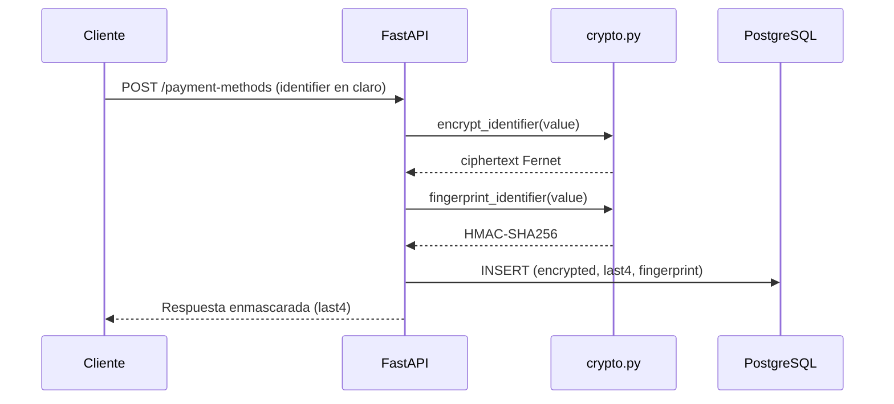

# Seguridad y trazabilidad

Esta nota describe como se manejan los datos sensibles, como se autentica el
usuario y como se registran las operaciones relevantes en la bitacora.

## Modelo de proteccion del identificador

Los identificadores de los metodos de pago (numero de tarjeta, numero de cuenta
o CLABE) son datos sensibles. Se almacenan en tres columnas con propositos
distintos:

| Columna                  | Reversible | Sirve para...                                    |
|--------------------------|------------|---------------------------------------------------|
| `identifier_encrypted`   | si         | recuperar el valor original cuando sea necesario |
| `identifier_last4`       | no aplica  | mostrar al usuario sin tener que descifrar       |
| `identifier_fingerprint` | no         | detectar duplicados por usuario                  |

### Cifrado Fernet

Se usa la implementacion de Fernet de `cryptography`. Internamente Fernet
combina AES-128-CBC para confidencialidad y HMAC-SHA256 para autenticidad, ambos
con claves derivadas de la llave maestra (`FERNET_KEY`). Cada operacion produce
un nonce nuevo, por lo que dos cifrados del mismo valor generan ciphertexts
distintos. Eso impide ataques basados en comparar ciphertexts.

La llave se genera una sola vez por entorno y se guarda en la variable de
entorno `FERNET_KEY`. Nunca se almacena en BD.

### Fingerprint para detectar duplicados

Para detectar que un usuario no registre dos veces el mismo identificador sin
necesidad de descifrar todo el listado, se calcula un HMAC-SHA256 con una
pimienta secreta (`FINGERPRINT_PEPPER`) sobre el identificador normalizado
(mayusculas, sin espacios ni guiones). El resultado vive en la columna
`identifier_fingerprint` con un indice compuesto con `user_id` y un constraint
unico que considera tambien el `is_deleted` para permitir reactivar metodos
borrados.

Como el HMAC no es reversible y la pimienta no viaja con el dato, un atacante
que solo tuviera la BD no podria reconstruir los identificadores ni
"forzar bruta" los fingerprint sin tambien comprometer la pimienta.

### Enmascaramiento

El listado y el detalle exponen unicamente:

- El `alias` y la `institution` (datos descriptivos definidos por el usuario).
- El `last4` (ultimos cuatro caracteres del identificador).
- Una mascara generada por el servidor con el patron `**** **** **** XXXX`.

El identificador completo no se descifra en operaciones de listado ni de
detalle: el backend nunca lo regresa.

## Autenticacion

- Las contrasenas se hashean con `bcrypt` mediante passlib antes de guardarse.
  El factor de costo es el predeterminado de passlib (12), suficiente para
  ralentizar ataques por fuerza bruta.
- Al iniciar sesion, el backend emite un JWT firmado con HS256. El payload
  contiene el id del usuario en `sub`, la fecha de emision (`iat`) y la
  expiracion (`exp`).
- El frontend guarda el token en `localStorage` y lo manda en cada peticion en
  el header `Authorization: Bearer <token>`. El interceptor axios se encarga de
  inyectarlo y de limpiar la sesion ante un 401.
- El logout es informativo: como JWT es stateless, el cliente descarta el token
  y se registra el evento en la bitacora. Para una entrega productiva con mayor
  exigencia conviene migrar a cookies HttpOnly + SameSite y una lista negra de
  tokens revocados.

## CORS

El backend solo acepta peticiones desde los origenes listados en
`CORS_ORIGINS`. Por defecto se permite `http://localhost:5173` para el
frontend Vite.

## Trazabilidad

Cada operacion relevante deja un renglon en la tabla `audit_logs`. La
implementacion vive en `app/services/audit_service.py`. Acciones registradas:

| Accion                        | Cuando se registra |
|-------------------------------|--------------------|
| `user_registered`             | Alta de usuario. |
| `user_login_success`          | Login exitoso. |
| `user_login_failed`           | Intento de login fallido (incluso si el correo no existe). |
| `user_logout`                 | Logout. |
| `payment_method_created`      | Alta de metodo de pago. |
| `payment_method_viewed`       | Consulta de detalle. |
| `payment_method_deactivated`  | Desactivacion. |
| `payment_method_deleted`      | Soft delete. |

Cada renglon guarda:

- `user_id` si aplica.
- `entity_type` y `entity_id` para identificar al recurso afectado.
- `ip_address` y `user_agent` capturados desde la peticion HTTP.
- `metadata` (JSON) con campos adicionales relevantes (tipo de metodo, moneda,
  correo en intentos fallidos, etc.).
- `created_at` con timestamp UTC.

La tabla nunca se actualiza ni se borra; sirve como bitacora append-only.

## Variables y secretos

Todas las variables sensibles viven en archivos `.env` (uno por servicio en el
caso de docker-compose). Existen archivos `.env.example` con valores neutros
para guiar el despliegue. Para produccion se recomienda:

- Generar `FERNET_KEY`, `JWT_SECRET_KEY` y `FINGERPRINT_PEPPER` con
  generadores criptograficamente seguros y guardarlos en un gestor de secretos.
- Rotar `JWT_SECRET_KEY` periodicamente y reducir `JWT_EXPIRE_MINUTES`.
- Mantener `FERNET_KEY` estable y respaldada de forma segura: rotarla obliga
  a recifrar el contenido existente.

## Resumen de buenas practicas aplicadas

- Cifrado simetrico autenticado (Fernet) para los datos sensibles.
- HMAC con pimienta para detectar duplicados sin exponer el dato.
- bcrypt para el almacenamiento de contrasenas.
- JWT con expiracion y dependencia de FastAPI que valida cada request.
- Soft delete para conservar trazabilidad.
- Auditoria con enum tipado y JSON para datos adicionales.
- CORS controlado por entorno.
